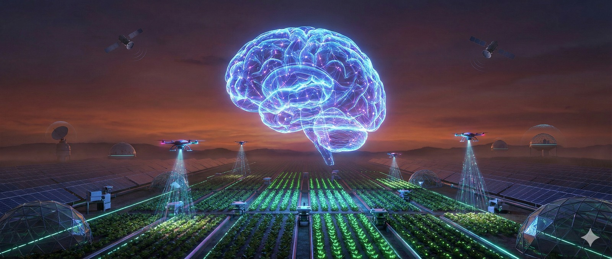

<h1 align="center">👋 Hi, I'm Nandita Nandakumar</h1>

 <b>Machine Learning Engineer | Applied AI & Computer Vision | Agentic & Autonomous Systems </b>

  Founding ML Engineer @ Krishiboot, IIT Bombay • Ex-AI/ML Engineer @ Atmos Climate
   <i>"Deploying AI where it matters most."</i>

  

    
    
    
  

---

 
  
### 💫 About Me
I’m a Machine Learning Engineer focused on building real-world systems with strong research interests in deep learning and computer vision. 
My current work focuses on developing intelligent, robust, and field-ready ML systems for precision agriculture and environmental monitoring

**🎯 Vision:** To become a **Lead AI Research Scientist** one day! I look forward to contributing to applied AI innovations that create measurable impact across industries.

---

### 🚀 What I Do & Areas of Interest

⚡ **Currently working on:**
- Build and train ML and computer vision models
- Develop end-to-end pipelines for agricultural & automated systems
- Deploy AI on edge devices (Jetson, ARM, microcontrollers)
- Work with **LLMs, multimodal models, & agentic AI**
- Improve model efficiency & integrate AI into production systems

---

🧠 **Research Interests:**
- Artificial Intelligence, Machine Learning & Deep Learning
- Computer Vision for agriculture & real-world systems
- Geospatial & satellite image analysis
- Edge AI, autonomous systems, & robotics
- MLOps & production-grade ML engineering

---

### 💻 Tech Stack:

#### Programming Languages

#### AI/ML & Data Science Frameworks

#### MLOps, Cloud & Databases

#### Hardware, DevOps & Tools

---

## 📊 GitHub Stats:
 

---

## 🏆 GitHub Trophies

---

## ✍️ Random Dev Quote

---

## 🔝 Top Contributed Repo

---

Open to research collaborations and exciting ML projects. Let's build AI that makes a difference! 🚀

